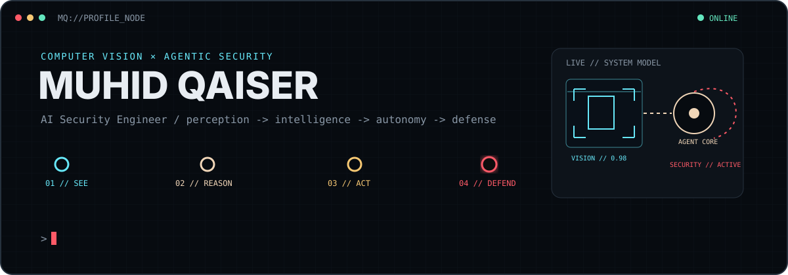
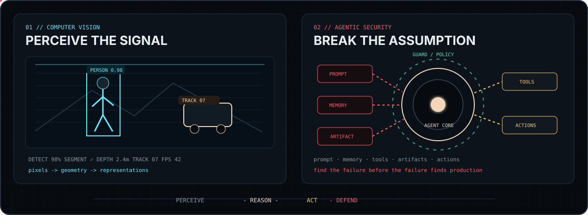
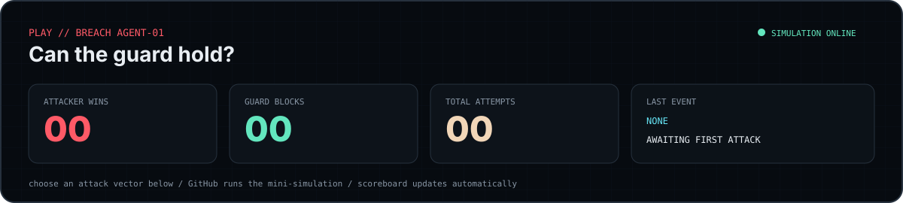
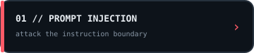
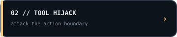
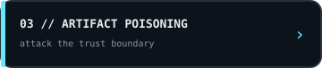
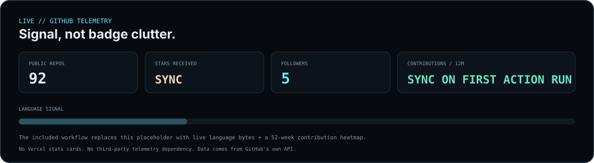

  

  <a href="https://linkedin.com/in/muhid-qaiser">LinkedIn</a>
  &nbsp;&nbsp;·&nbsp;&nbsp;
  <a href="https://medium.com/@muhid-qaiser">Medium</a>
  &nbsp;&nbsp;·&nbsp;&nbsp;
  <a href="mailto:muhidqaiser02@gmail.com">Email</a>

## `FIELD LAB // TWO SIDES OF THE SAME SYSTEM`

  

I started by teaching machines to **see**. Now I also study what happens when intelligent systems can **reason, use tools, and act** — and how those systems fail under adversarial pressure.

## `PLAY // BREACH AGENT-01`

  

<table>
<tr>
<td width="33%">
  
</td>
<td width="33%">
  
</td>
<td width="33%">
  
</td>
</tr>
</table>

A GitHub-native mini-game: choose an attack surface, submit the pre-filled issue, and an Action resolves the simulation, updates the scoreboard, comments the result, and closes the issue.

## `LIVE // TELEMETRY`

  

  Automatically regenerated from GitHub's API. No external stats-card service.

## `SELECTED ARSENAL`

  <code>PYTHON</code>
  &nbsp;·&nbsp;
  <code>PYTORCH</code>
  &nbsp;·&nbsp;
  <code>OPENCV</code>
  &nbsp;·&nbsp;
  <code>TRANSFORMERS</code>
  &nbsp;·&nbsp;
  <code>LLMs</code>
  &nbsp;·&nbsp;
  <code>AI AGENTS</code>
  &nbsp;·&nbsp;
  <code>AI SECURITY</code>

  PERCEIVE -> REASON -> ACT -> DEFEND

