  <a href="https://pk.linkedin.com/in/muhid-qaiser">LinkedIn</a>
  &nbsp;·&nbsp;
  <a href="https://muhid-qaiser.medium.com/">Medium</a>
  &nbsp;·&nbsp;
  <a href="mailto:muhidqaiser02@gmail.com">Email</a>

<table>
<tr>
<td width="50%">
  
</td>
<td width="50%">
  
</td>
</tr>
<tr>
<td width="50%">
  
</td>
<td width="50%">
  
</td>
</tr>
</table>

  <a href="https://pk.linkedin.com/in/muhid-qaiser">LinkedIn</a>
  &nbsp;·&nbsp;
  <a href="https://muhid-qaiser.medium.com/">Medium</a>
  &nbsp;·&nbsp;
  <a href="mailto:muhidqaiser02@gmail.com">Email</a>

  The map and the ledger redraw themselves nightly from the GitHub API. Nothing here is a badge service.

